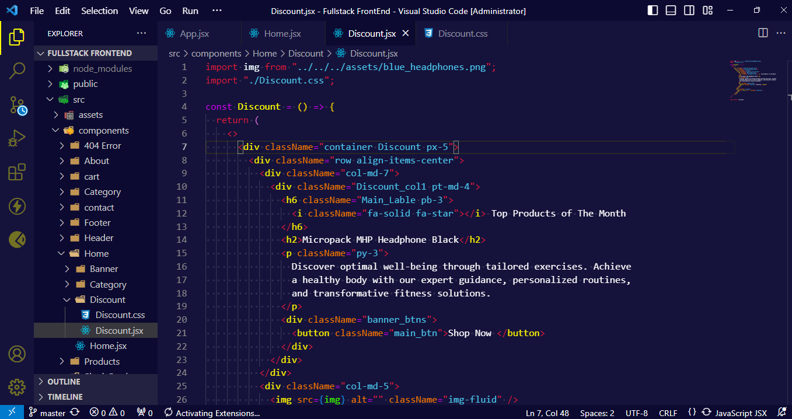
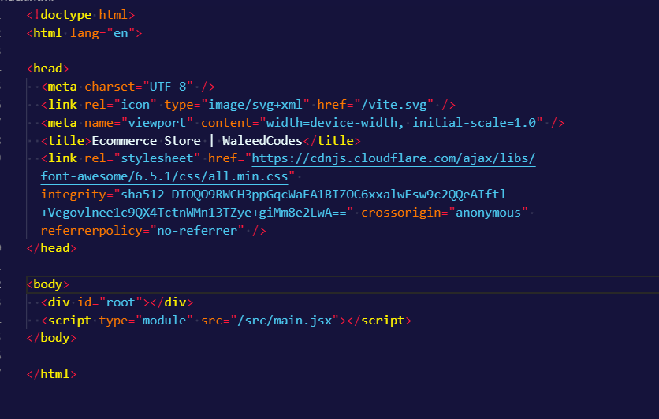

# Purple Tipper Dark Theme for Visual Studio Code: Immerse Yourself in Creativity 💜

Welcome to the Purple Dark Theme for Visual Studio Code – where sophistication meets functionality, and creativity thrives in the depths of elegant purple hues.

# Key Features:

- **Elegant Aesthetic** : Immerse yourself in a refined coding environment adorned with deep shades of purple, elevating your coding experience with an aura of sophistication.

- **Enhanced Readability** : Reduce eye strain and enhance readability with meticulously chosen color contrasts and intuitive syntax highlighting, ensuring your code remains clear and comprehensible.

- **Boosted Productivity** : Stay focused and productive for extended coding sessions with a visually pleasing yet highly functional theme that minimizes distractions and maximizes coding efficiency.

- **Creative Inspiration** : Let the calming tones of purple inspire your creativity and innovation, transforming each line of code into a stroke of artistic brilliance.

- **Customizable Experience** : Tailor the theme to your preferences with customizable options, allowing you to adjust the intensity of purple and fine-tune other visual elements to perfectly complement your coding style.

- **Community Support** : Join a vibrant community of developers who appreciate the elegance and functionality of the Purple Dark Theme. Share tips, tricks, and customizations to enhance your coding experience even further.

# Live Preview :

Experience the Purple Dark Theme in action on the Visual Studio Code Marketplace: Live Preview

# Javascript Preview Screenshot:

# HTML Preview Screenshot:

# Contributors:🧔

- Waleed Ishfaq

# Download For Free :

> https://marketplace.visualstudio.com/publishers/waleedcodes

# Stay Connected:

Follow us on <a href="https://www.youtube.com/@waleedcodes" target="_blank">YouTube</a> for updates, tutorials, and more!
